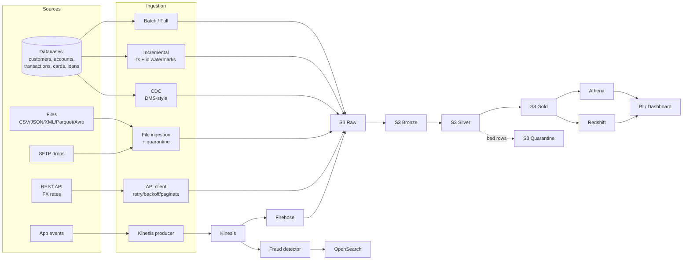

# DataForge

**Production-Style End-to-End AWS Data Engineering Platform**


DataForge is a comprehensive **reference implementation** of a modern
financial data platform for a fictional bank, **DataForge Bank**. It
demonstrates — in one coherent, runnable project — the full data
engineering lifecycle across batch, incremental, CDC, API, file, SFTP, and
streaming paradigms, with data quality, orchestration, IaC, CI/CD, tests,
and extensive documentation.

> **Runs locally with no AWS account.** Every core pattern executes in
> **LOCAL MODE** against synthetic data + SQLite. AWS-specific pieces are
> provided as **deployable Terraform / clearly-labelled reference code**.
> No real customer data is ever used; no secrets are committed.

---

## Architecture



Orchestrated by **AWS Step Functions** (Lambda + Glue + DQ + Redshift),
provisioned by **Terraform**, shipped by **GitHub Actions**. See
[`docs/architecture.md`](docs/architecture.md) for the batch, streaming,
and CDC architecture breakdowns.

---

## Technology stack

| Layer | Technology | Where in the repo |
| --- | --- | --- |
| Synthetic data | Python + Faker + NumPy | `src/dataforge/data_generation/` |
| Ingestion | Python, JDBC, Kinesis, Transfer Family | `src/dataforge/ingestion/`, `streaming/` |
| Transform | pandas (local) + PySpark/Glue | `src/dataforge/transformations/`, `transformations/`, `glue/` |
| SQL | Athena / Redshift | `sql/` |
| Modelling | dbt | `dbt/` |
| Data quality | custom engine + Great Expectations / Glue DQ | `src/dataforge/data_quality/` |
| Data lake | S3 (raw/bronze/silver/gold) | `src/dataforge/common/lake.py` |
| Warehouse | Amazon Redshift | `sql/staging/redshift_setup.sql` |
| Orchestration | Step Functions, Airflow | `orchestration/` |
| Serverless | AWS Lambda | `lambda/` |
| IaC | Terraform | `infrastructure/terraform/` |
| CI/CD | GitHub Actions (OIDC) | `.github/workflows/` |
| Monitoring | CloudWatch, SNS | `monitoring/` |
| Tests | pytest | `tests/` |

---

## Quick start (LOCAL MODE — no AWS needed)

```bash
# 1. Set up the environment (Python 3.10+)
make setup            # or: make setup-lite   (no Spark)

# 2. Generate synthetic banking data (small | medium | full)
make generate-data RECORDS=small

# 3. Run the full batch pipeline: RAW -> BRONZE -> SILVER -> GOLD + star schema
make run-local

# 4. Run the incremental (watermark + MERGE) pipeline
make run-incremental

# 5. Run the data-quality suite (writes a JSON report)
make run-dq

# 6. Run the streaming + real-time fraud detection demo
make stream-demo

# 7. Tests + lint
make test
make lint
```

Without `make`:

```bash
python -m venv .venv && source .venv/bin/activate
pip install -e ".[api,files,dev]"
python scripts/generate_data.py --profile small
python -m dataforge.pipelines.local_batch_pipeline
pytest
```

### Expected output (abridged)

`make run-local`:

```
Local batch pipeline summary:
  bronze_transactions              20,000
  silver_transactions              19,668     # bad rows quarantined
  fact_transaction                 19,668
  dim_customer                      1,000
  daily_transaction_summary         5,617
```

`make stream-demo`:

```
Streaming + fraud detection demo:
  produced               159
  duplicates_dropped     1          # idempotency
  alerts_by_rule         {'HIGH_VALUE': 1, 'VELOCITY': 2, 'IMPOSSIBLE_TRAVEL': 2}
```

---

## What's demonstrated

- **Ingestion**: full extract, incremental (timestamp + id watermarks),
  CDC (INSERT/UPDATE/DELETE + latest-state reconstruction), resilient REST
  API (pagination/retry/backoff/rate-limit), file (CSV/JSON/XML/Parquet/
  Avro with schema validation + quarantine), SFTP, and Kinesis streaming.
  → [`docs/ingestion-patterns.md`](docs/ingestion-patterns.md)
- **Transformation**: filter/select/cast/null-handling/dedup, all join
  types, window functions, aggregations, SCD Type 1 & 2, star schema.
  → [`docs/transformation-patterns.md`](docs/transformation-patterns.md)
- **Storage/serving**: medallion data lake (raw→bronze→silver→gold),
  star schema, Athena external tables + CTAS, Redshift COPY/MERGE, dbt
  models/tests/snapshots. → [`docs/data-model.md`](docs/data-model.md)
- **Data quality**: declarative expectation engine, bad-data quarantine,
  DQ report. → [`docs/data-quality.md`](docs/data-quality.md)
- **Streaming**: Kinesis-style producer/consumer with idempotency,
  checkpointing, late-arrival handling, and a real-time fraud rule engine.
- **Orchestration**: Step Functions state machine, Lambda, Airflow DAG.
  → [`docs/orchestration.md`](docs/orchestration.md)
- **Reliability**: watermarking, idempotency ledger, retry/backoff,
  retryable vs non-retryable errors, dead-letter/quarantine.
- **IaC / CI-CD / Security / Monitoring / Cost**: see the docs links below.

The full pattern → technology → example mapping is in
[`docs/pattern-matrix.md`](docs/pattern-matrix.md).

---

## AWS MODE (optional, incurs cost)

```bash
bash scripts/deploy.sh dev      # terraform init + validate + plan + apply
# ... demonstrate ...
bash scripts/destroy.sh dev     # tear everything down
```

> ⚠️ **Cost warning.** Glue jobs, Kinesis (provisioned), Redshift, and MWAA
> are billable and can be expensive. DataForge defaults to free-tier-
> friendly / on-demand options and provides local alternatives for
> everything. Always run `destroy` when finished. See
> [`docs/cost-optimization.md`](docs/cost-optimization.md).

CI/CD authenticates to AWS with **GitHub OIDC** — no long-lived keys are
stored. See [`docs/security.md`](docs/security.md).

---

## Documentation

| Doc | Contents |
| --- | --- |
| [architecture.md](docs/architecture.md) | Batch / streaming / CDC architectures, data-lake zones |
| [data-model.md](docs/data-model.md) | ERD, star schema, keys, grain |
| [ingestion-patterns.md](docs/ingestion-patterns.md) | All 7 ingestion paradigms in depth |
| [transformation-patterns.md](docs/transformation-patterns.md) | pandas/Spark/SQL/dbt, windows, SCD, Spark tuning |
| [data-quality.md](docs/data-quality.md) | Rules, quarantine, reporting |
| [orchestration.md](docs/orchestration.md) | Step Functions, Lambda, Airflow |
| [security.md](docs/security.md) | IAM, KMS, Secrets Manager, OIDC, networking |
| [monitoring.md](docs/monitoring.md) | CloudWatch logs/metrics/alarms, KPIs |
| [cost-optimization.md](docs/cost-optimization.md) | Cost estimates + local alternatives |
| [lineage.md](docs/lineage.md) | End-to-end data lineage |
| [design-decisions.md](docs/design-decisions.md) | Why each technology + tradeoffs |
| [pattern-matrix.md](docs/pattern-matrix.md) | Pattern → technology → example matrix |
| [interview-questions.md](docs/interview-questions.md) | 100+ Q&A for interview prep |

---

## Repository layout

```
dataforge/
├── src/dataforge/         # the Python package (importable, tested)
│   ├── common/            # config, logging, metadata, idempotency, errors
│   ├── data_generation/   # Faker-based synthetic data
│   ├── ingestion/         # batch / database / files / api / sftp / cdc
│   ├── transformations/   # pandas + spark, windows, scd, star schema
│   ├── data_quality/      # expectation engine + rules
│   ├── streaming/         # producer/consumer + fraud detection
│   └── pipelines/         # runnable local batch + incremental pipelines
├── sql/                   # Athena/Redshift SQL (transforms, dims, facts, analytics)
├── dbt/                   # dbt project (staging/intermediate/marts + tests)
├── glue/                  # Glue jobs, crawlers, workflows
├── transformations/       # deployable PySpark jobs + optimisation example
├── streaming/             # Kinesis + Firehose references
├── orchestration/         # step_functions, airflow, schedules
├── lambda/                # Lambda handlers
├── infrastructure/        # Terraform modules + dev/prod + IAM policies
├── monitoring/            # CloudWatch dashboards, alarms, Log Insights
├── tests/                 # unit / integration / data_quality
├── scripts/               # generate_data / deploy / destroy
├── config/                # dev.yaml / prod.yaml / data_profiles.yaml
└── docs/                  # all documentation
```

---

## Troubleshooting

| Symptom | Fix |
| --- | --- |
| `Source DB not found` | Run `make generate-data` first. |
| `ModuleNotFoundError: dataforge` | `pip install -e .` (or run via `make`). |
| PySpark tests skipped/failing | Spark is optional; use `make test-fast` or install `.[spark]`. |
| XML/Avro `NonRetryableError` | Install the files extra: `pip install ".[files]"`. |
| `terraform: command not found` | Terraform is only needed for AWS MODE deploy. |
| Unexpected AWS charges | Run `bash scripts/destroy.sh dev` and check the console. |

---

## Future improvements

- Iceberg/Delta table format for ACID + time travel on the lake.
- Real Great Expectations checkpoints + Data Docs.
- OpenLineage / Marquez for automated lineage capture.
- Great Expectations → Glue Data Quality parity in AWS MODE.
- Backfill tooling and partition-level reprocessing.

---

## License

MIT — see [LICENSE](LICENSE). Synthetic data only; not affiliated with any
real bank.
