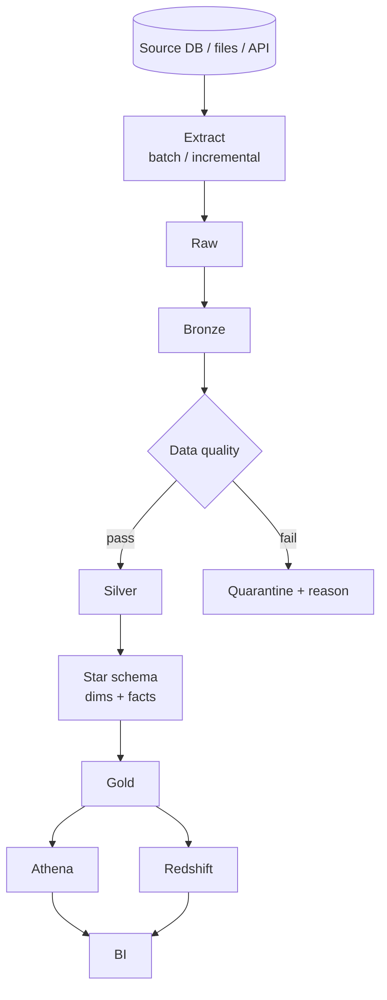
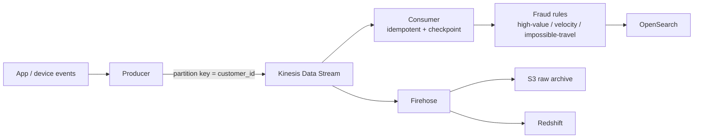
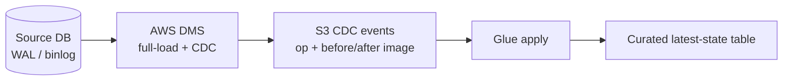

# Architecture

DataForge follows a **medallion (multi-hop) data-lake** architecture with a
serving layer on top, plus a parallel streaming path and a CDC path.

## Data-lake zones

| Zone | Contract | Format | Example |
| --- | --- | --- | --- |
| **raw** | bytes exactly as received; immutable audit trail | source-native (CSV/JSON/XML) | `s3://dataforge/raw/` |
| **bronze** | parsed into typed columns, minimal cleaning, provenance columns | Parquet (Snappy) | `s3://dataforge/bronze/` |
| **silver** | cleansed, deduplicated, conformed, quality-checked | Parquet, partitioned | `s3://dataforge/silver/` |
| **gold** | business marts: star schema + aggregates | Parquet, partitioned | `s3://dataforge/gold/` |
| **quarantine** | rejected records + a reason | Parquet | `s3://dataforge/quarantine/` |

Why layered? Each hop has one job, so failures are isolated and
reprocessing is cheap. Raw is the source of truth you can always replay
from; silver is where consumers trust the data; gold is shaped for BI.

## Batch architecture

Runnable locally: `src/dataforge/pipelines/local_batch_pipeline.py`.

## Streaming architecture

Runnable locally: `src/dataforge/streaming/local_stream_demo.py`.

## CDC architecture

Full-load + CDC = one snapshot, then continuously apply the change stream.
Latest state is reconstructed by applying events per primary key in
timestamp order (INSERT/UPDATE = upsert after_image, DELETE = remove).
Reference: `src/dataforge/ingestion/cdc/cdc.py`.

## Orchestration

Step Functions coordinates the batch lifecycle
(`orchestration/step_functions/daily_pipeline.asl.json`); an EventBridge
schedule triggers it daily. An equivalent Airflow DAG is provided for teams
that prefer Airflow.

## Local vs AWS mode

Everything has a **LOCAL MODE** (filesystem lake + SQLite) and an **AWS
MODE** (S3 + Glue + Redshift + Kinesis). The Python transform/DQ logic is
identical across both; only the I/O boundary changes. This keeps the
project studyable without an AWS bill while remaining genuinely deployable.
