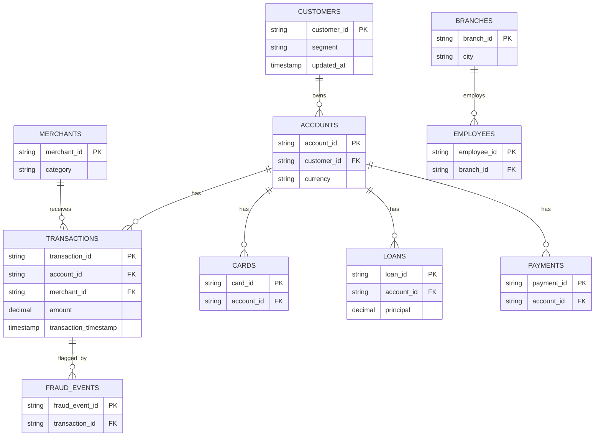
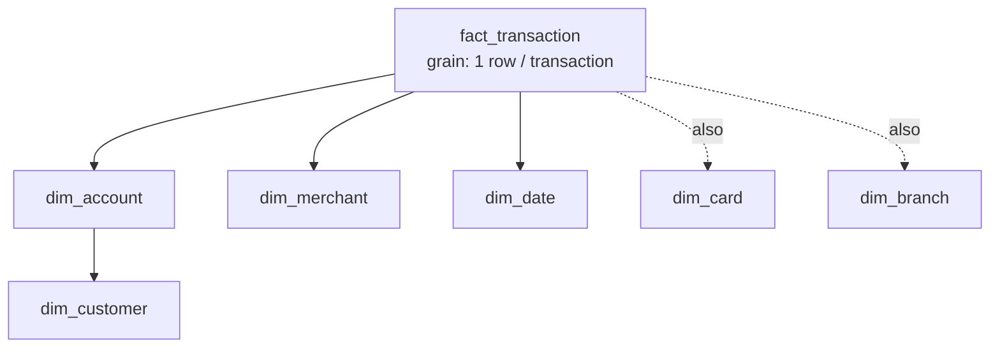

# Data model

## Source (OLTP) model

Generated by `src/dataforge/data_generation/`. Volumes are configurable
(`config/data_profiles.yaml`); the `full` profile produces 100k customers /
200k accounts / 2M transactions.

## Warehouse (star schema)

Built by `src/dataforge/transformations/star_schema.py` (local) and
`sql/facts/star_schema.sql` (Redshift/Athena).

### Keys and grain

- **Natural key** — the business id from the source (`customer_id`,
  `transaction_id`). Stable to the business, but can change/collide across
  source systems.
- **Surrogate key** — a system-generated, business-meaningless key for each
  dimension row (`customer_sk`). Insulates facts from source-key changes
  and, crucially, lets **SCD Type 2** store multiple versions of the same
  natural key (one surrogate per version). DataForge derives surrogates as
  a short hash of the natural key (+ effective date for SCD2).
- **Fact grain** — the level of detail of one fact row.
  `fact_transaction` grain = **one row per transaction**. Never mix grains
  in a fact table.
- **Dimension grain** — one row per entity (SCD1) or per **version** of an
  entity (SCD2).

### Facts and dimensions

| Table | Type | Grain | Measures / notable columns |
| --- | --- | --- | --- |
| `fact_transaction` | fact | 1 / transaction | amount, fraud_flag |
| `fact_payment` | fact | 1 / payment | amount |
| `fact_loan` | fact | 1 / loan | principal, outstanding |
| `fact_fraud` | fact | 1 / fraud event | severity |
| `dim_customer` | dimension (SCD2-capable) | 1 / customer version | segment, city, country |
| `dim_account` | dimension | 1 / account | account_type, currency |
| `dim_card` | dimension | 1 / card | card_type |
| `dim_merchant` | dimension | 1 / merchant | category |
| `dim_branch` | dimension | 1 / branch | city |
| `dim_date` | conformed dimension | 1 / calendar day | year/quarter/month/day |

## Slowly Changing Dimensions

- **Type 1** (overwrite): `dim_customer` corrections where history doesn't
  matter. See `scd_type_1` / `sql/dimensions/scd.sql`.
- **Type 2** (versioned): customer address/city changes tracked with
  `effective_from` / `effective_to` / `is_current` + surrogate key, so you
  can answer "where did the customer live at the time of this transaction".
  See `scd_type_2`, the dbt `snapshots/customer_snapshot.sql`, and
  `sql/dimensions/scd.sql`.
